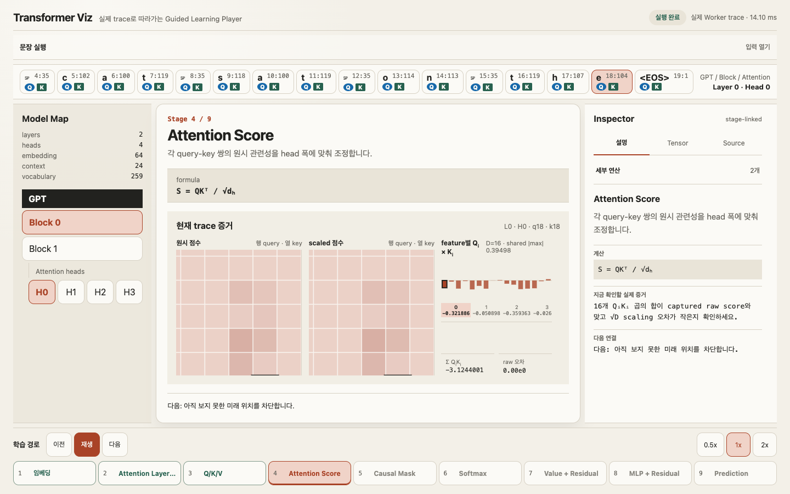

# Transformer Viz

Transformer Viz는 작은 nanoGPT-compatible Transformer의 실제 forward trace를 브라우저에서
아홉 단계로 따라가는 Guided Learning Player입니다. It is a backend-free Rust/WASM teaching app:
Leptos renders the interface while a dedicated Rust Web Worker performs Candle CPU inference and
returns versioned, serialized tensor evidence.



## Guided Player 사용법 / How to use it

1. 상태가 **준비 완료**가 될 때까지 기다립니다 / wait for **Ready**.
2. 기본 문장 `the cat sat on the` 또는 분석할 문장을 입력하고 **실행**을 누릅니다.
3. Context Bar에서 현재 query `Q`, key `K`, Layer, Head를 확인합니다.
4. Stage Rail의 이전/재생/다음 또는 단계 버튼으로 실제 trace를 이동합니다.
5. Inspector의 **설명 / Tensor / Source** 탭에서 개념, 정확한 값, 고정 nanoGPT 소스를
   비교합니다.
6. Model Map에서 레이어와 헤드를 바꾸면 현재 실행의 캐시된 trace를 다시 검사합니다.

The exact nine-stage learning flow is:

1. **Embedding** - token embedding과 position embedding을 더합니다.
2. **Attention LayerNorm** - attention 입력의 특징 규모를 맞춥니다.
3. **Q/K/V** - 찾을 정보, 제공할 표지, 전달할 값을 투영합니다.
4. **Attention Score** - `QK^T / sqrt(d_head)`를 계산합니다.
5. **Causal Mask** - 미래 key를 hatch와 mask 상태로 차단합니다.
6. **Softmax** - 허용된 key 사이의 점수를 확률로 정규화합니다.
7. **Value + Residual** - 확률로 V를 모으고 residual stream에 더합니다.
8. **MLP + Residual** - 토큰별 비선형 특징 변환을 다시 residual에 더합니다.
9. **Prediction** - final LayerNorm과 tied embedding head로 Top-10을 확인합니다.

Stage movement, playback, Inspector tabs, feature selection, and the responsive Model Map drawer are
browser-only actions. Layer/head/token/attention-cell changes request cached trace detail from the
Worker; they do not rerun the full model.

## Model and scope

The bundled `nanogpt-edu` model is nanoGPT-compatible, **not GPT-2 124M and not a general-purpose
language model**. It has 2 blocks, 4 attention heads, embedding width 64, context length 24,
vocabulary size 259, bias enabled, and f32 weights. Its deterministic byte-fallback tokenizer
reserves BOS `0`, EOS `1`, and UNK `2`, then maps byte `b` to `b + 3`.

The Worker returns real embeddings, LayerNorm, Q/K/V, causal scores and probabilities, value
aggregation, residuals, MLP tensors, final normalization, and full-vocabulary logits. The main
thread renders only serialized trace data. See [the trace schema](docs/TRACE_SCHEMA.md),
[architecture](docs/ARCHITECTURE.md), and [model format](docs/MODEL_FORMAT.md).

## Setup and development

Prerequisites are `rustup`, Cargo, and Git.

```sh
git clone --recurse-submodules https://github.com/code0-god/transformer_viz.git
cd transformer_viz
./scripts/bootstrap.sh
cd apps/web
trunk serve --open
```

Bootstrap initializes the pinned nanoGPT submodule, Rust **1.94.0**, the
`wasm32-unknown-unknown` target, and Trunk **0.21.14**. The app then runs at
`http://127.0.0.1:8080/`; no backend or Python process is used.

The web application and Worker live in `apps/web`. Schema, tokenizer, model, and trace
responsibilities are separate crates under `crates/`. The Guided Player decision is recorded in
[ADR 0003](docs/adr/0003-guided-learning-player.md); the existing schema/tokenizer ADR remains at
[docs/adr/0003-schema-and-tokenizer.md](docs/adr/0003-schema-and-tokenizer.md).

## Test and release

```sh
./scripts/check.sh
./scripts/build-web.sh /                 # root-hosted release
./scripts/build-web.sh /transformer_viz/ # GitHub Pages project subpath
```

`check.sh` runs rustfmt, strict Clippy, workspace tests, a workspace release build, the WASM package
check, asset integrity/copy checks, forbidden dependency checks, and a root Trunk release. The only
deployable artifact is `apps/web/dist`: static HTML, CSS, JavaScript loader glue, WebAssembly, and
same-origin model assets, with no Python or server program.

## Static deployment

`.github/workflows/ci.yml` runs the repository gate for pushes and pull requests. The Pages workflow
builds with public URL `/transformer_viz/`, uploads `apps/web/dist`, and deploys through GitHub
Pages. Repository Pages must use **GitHub Actions** as its source.

Application, Worker, model, tokenizer, and glue URLs resolve from the document base. Root hosting
and project-subpath hosting therefore preserve the same browser Worker flow and same-origin asset
policy. Browser support requires module Workers and WebAssembly.

## Measured artifact

Measurements use the committed model and a Trunk 0.21.14 release built on macOS 26.5.2 arm64:

| Item | Measured value |
|---|---:|
| Learned parameters | 118,208 |
| `model.safetensors` | 475,432 bytes |
| Model SHA-256 | `8fd76c662da0d0cb9fe1035cb205b1a071ad95f9e22d116578a0a8bec0754be9` |
| Static `dist` size | 3,201,006 apparent bytes; 3.1 MiB (`du -sh`) |
| Largest native/Python absolute error | `2.86102295e-6` (logits) |
| Parity tolerance | absolute + relative `1e-4` |

For prompt `the cat sat on the`, the deterministic reference continuation is `mat`. The first
three Top-3 token IDs are `[112, 107, 1]` (`m`, `h`, EOS), followed by `[100, 119, 1]` (`a`, `t`,
EOS), then `[119, 100, 35]` (`t`, `a`, space). The expected continuation byte is in Top-3 at every
step; this is a fixture quality check, not a broad language-quality claim.

A single warm Worker run for that prompt reported **0.70 ms** model/trace execution on an Apple M5
Pro using Chrome 151.0.7922.172 on macOS 26.5.2. It excludes asset download and WASM startup and is
an environment-specific observation, not a benchmark. Full tensor errors and fixture provenance are
in [the numerical parity report](docs/NUMERICAL_PARITY.md).

## Reference assets and implementation

Python is needed only to retrain or regenerate golden files. Follow
[tools/reference/README.md](tools/reference/README.md), then run `./scripts/check.sh` to prove model
copies, checksums, Rust parity, WASM target, and static release agree.

`reference/nanoGPT` is a read-only Git submodule pinned to an immutable upstream commit. It is a
compatibility and golden-fixture reference, not a runtime dependency. Provenance and license details
are in [reference/NANOGPT_SOURCE.md](reference/NANOGPT_SOURCE.md) and
[THIRD_PARTY_NOTICES.md](THIRD_PARTY_NOTICES.md).

## Limits

- Inputs are limited to 24 tokens including BOS/EOS; non-ASCII text uses multiple byte tokens.
- CPU f32 inference favors transparency over throughput; only one tiny educational model ships.
- Runtime assets must stay same-origin; inference never calls an external API.
- Source links point to pinned upstream code and license records.

## License

Transformer Viz is licensed under the MIT License. The CC0 corpus/model and MIT nanoGPT reference
retain the terms documented in [THIRD_PARTY_NOTICES.md](THIRD_PARTY_NOTICES.md).
